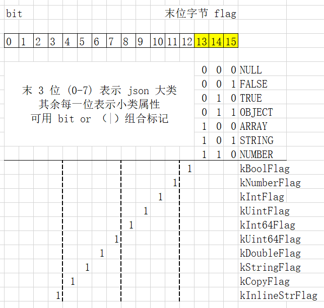
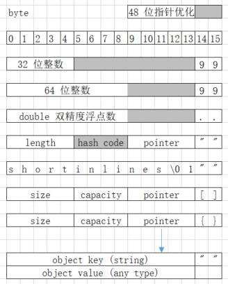

+++
title = "深入浅出理解 rapidjson 与实践"
draft = false
[taxonomies]
categories = ["程序设计"]
tags = ["C++", "json","library"]
[extra]
toc = true
+++

众所周知，JSON 是通用对象表示法。原全称是 JavaScript Object Notation ，是从
javascript 语言流行开来的。json 在 javascript 源码中就是合法的对象字面量表示，
可认为是后者的一个子集，语法更严格，但也更简单，基本可望文生义。后来也有人提出
json5 的扩展语法，能支持注释等，更接近 javascript 的语法（但仍不完全一样），但
也不如标准 json 那样流行，简单够用。

如今，几乎所有流行与不流行的编程语言都支持 json ，能将 json 文本串解析为各自语
言内部的对象模型表示。这是通过库来实现的，不能像 javascript 那样直接将 json 粘
贴到源代码中就是合法对象（一般可用在 `=` 作右值常量），虽然有的语言可能有语法
糖能在源代码中通过对 json 串作少量的修饰而转化为内部对象，但本质上也是经过了库
解析。而事实上，对于大对象，长 json 串，即使 javascript 也不会直接嵌在源代码中，
而是先从外部读入字符串，再通过 `JSON` 库将其解析为对象。

Json 的文本表示即字符串，也叫对象的序列化，而将 json 文本转为语言内部对象的工
作叫反序列化。各大语言的 json 库的基本功能或主要功能就是这两个方面。本文将讨论
的 C++ ，更是有许多不同的 json 库。笔者使用最多的是 rapidjson 库，这是个老牌的
经典 json 库，在 modern C++11 之前就存在的高性能 json 库，至今也在一众 C++ 
常见 json 库的前一档。所以笔者强烈推荐这个 C++ 开源库，它是 head-only 库，只要
下载头文件，很容易集成进自己项目试水。
<!-- more -->

## 细说 json 类型

### 六大类型的标量与集合

标准 json 就六种类型：

1. Number 数字类型，不分整数或浮点数，在原生 javasrcipt 中用 `double` 表示；
2. String 字符串类型，也叫文本类型，严格地说要符合 `utf-8` 编码的字节串；
3. Array 数组类型，有序包含多个其他类型；
4. Object 对象类型，用键值对包含多个其他类型，其中键只能是字符串；
5. Boolean 表示只有两种状态的布尔类型，也就只有两个值 `true` 或 `false`；
6. Null 表示值空缺的状态，就一个值 `null` 。

一个简单的 json 示例如下：

```json
{
  "number": 123,
  "string": "hello world",
  "array": [1, 2, 3.14, "string"],
  "object": {
    "key": "value",
    "no-value": null,
    "bool-value": true
  }
}
```

再仔细审视 json 这六种值类型，这是从底层表示或实现划分的，如果从应用逻辑的抽象
角度再去考虑，又主要可以分为两大类，或三类：

1. 标量，表示一个值，用数字或字符串表达一个意义；
2. 集合，数组代表有序集合，对象代表无序集合，因其无序，所以要用键名取值；
3. 特殊标记值，就是 `true` `false` 与 `null` 这三个。

最后一类，从某种意义上看也可算是标量，但事实上即使没有这类的三个特殊值，也能满
足实际的应用需求。所以，从实用角度讲，标量就认为只是数字或字符串，这算是在计算
机信息处理的基本分子，而分子的有机组合，就构成了功能实体，类似物理学科所讲的物
质或生物学所讲的细胞组织。所以，json 就能用这个简单的模型来表示现实世界的逻辑
抽象模型，而它是语言中立的，各个语言都能很容易将这个模型映射到自己语言特有的类
型或对象系统中。

### 忽视 josn 类型的误区

一个常见的误区是，把 json 等效为对象，或认为 json 的根只能是对象，就是一对大括
号 `{}` 包裹一些键值对。虽然大多用 json 交换数据的数应用系统确实长这样，但并不
代表这是唯一合法的 json 。以数组 `[]` 为根的数据也是常见且实用，主要是表达对象
数组的含义。此外，即使简单的一个数字或（双引号包含的）字符串，它们也是合法的
json ，虽然这不常见，但也应该考虑这种特殊情况是否会引起异常。当然了，那些不是
以对象为根的 json ，也容易转为以对象为根的 json ，不外是多包一层 `{}` ，将原
json 当成它的唯一值，再取个好听恰义的键名。

另一个误区或不良实践，是标量只用字符串表示，数字也加上了引号，这在前端通过表单
输入构成的 json 就容易变成这样子。json 是有类型的，数字与文本两大类型还是应该
根据 json 标准来区分的，这不仅是逻辑上的意义不同，很多强类型语言在 json 实现中
对数字与字符串也是需要不同处理的。如果说字符串理论上可以表达一切，确实如此，字
符串也能表达数组与对象，试看下面的例子：

```json
{
  "number": "123",
  "array": "[1,2,3]",
  "object": "{\"key\":\"value\"}"
}
```

显然，这段 json 数组想表达的真实意图是：

```json
{
  "number": 123,
  "array": [1,2,3],
  "object": {"key":"value"}
}
```

对于数组与对象，很少有人会这么滥用字符串，毕竟知道难看，而用字符串表达数值类型
与这本质上是同样的错误。如果系统设计只支持一层对象结构，那么将个别的子对象序列
化的文本存为字符串还算有妥协意义。但用字符串表示数字，那基本就是偷懒意义了。

不过也有个例外，json 能表示的数值精度有限，可能无法表达大整数，比如长 id 。尤
其是原生 javascript 及其他很多弱类型语言，用 8 字节的 `double` 表示数字，那就
不能安全地表达 64 位整数，而很多系统会用 64 位整数作 id 。然而从应用逻辑看，id
算是文本意义，因为常规数字支持的四则运算对 id 是没有意义，对 id 最主要的操作是
比较用于查找（自增也有意义，但非必要，且字符串定义自增操作也是有意义）。所以
id 在系统之间适合用字符串传递，而各系统在接收后也完全可以把它当作字符串处理，
只有在意计算与存储性能时才会把它转为整数来处理。

除此之外，在应用逻辑上该是整数的数据，尤其是上限不超常用的 32 位整数时（用
`double` 能安全表达的整数上限其实比 32 位整数大，但比 64 位整数小），就该坚持
用 json 的数字类型，不要加双引号，这对传输与解析效率都是有利的。此外，在需要对
json 瘦身的场合，可以考虑用更简短（但仍要有可读意义）的键名，以及善用数组代替
对象，减少键名的使用。

标准 Json 的数字类型只支持十进制表示法，不区分整数或小数（浮点数）。但严肃项目
中，尽量避免浮点数吧，因为浮点数计算精度有累积误差问题，不同语言不同库对浮点数
的序列化与反序列化甚至也会有偏差。因此，规定浮点数精度或小数数位格式化改用字符
串传递也可能是合理的。但如果能约定小数位数的精度，那为何不直接扩大这么多倍数改
用整数交互呢？

此外，如果系统不涉及无理数，但要求精确的有理小数，可以用考虑只包含两个元素的数
组（分别表示分子与分母）来表示小数。什么，你的系统居然要处理复数？那么用一个对
象的两个键分别表示实部与虚部即可解决。

在具体的系统或项目中，json 的布尔类型可能是不必要的，用数字 `0` 与 `1` 就可以
分别代替 `false` 与 `true` 的意义，并且增加传输效率。不过一些强类型语言的库可
能会严格区分整数与布尔类型，为了好好协作，作也同样的严格区分也是符合标准。不过
决定一个值使用布尔类型前要谨慎确定需求，别搞出后面改需求说不止两个状态的尴尬。

至于 `null` ，我是反对在序列化传输中出现 `null` ，没有值的字段就不传嘛，没必要
多此一举传 `null` 还增加传输流量。我相信在绝大部分系统开发中，都不会对“不传”与
传 `null` 作不同的解释而进入不同的代码分支，所以传 `null` 只不过增加错误或异常
处理的难度与麻烦。`null` 应该只限定于系统内部运算时出现的特殊状态标记，但序列
化后应该剔除对象中值为 `null` 的键。在数组中，`null` 也许能起到占位的作用，不
能武断删除，比如短数组约定不同位置有不同意义，但均质意义的长数组剔除 `null` 是
安全的。数组中连续的逗号，不符合标准 json 语法，但或许有的 json 库能容许解析出
`null` ，确有此需求时，应统一写上 `null` 。

## 深入 rapidjson 内存模型

根据 json 的数据表达模型，考虑在 C++ 中该如何表示呢？我们先做个直观与初步的联
想，再参看 rapidjson 的实现。

### C++ 的 json 概念类型

C++ 是强类型语言，每种类型都代表着一种内存模型，即根据类型来解释一段内存区域的
字节表示什么意义。而 json ，如上所述，是多种类型的混合。在 C++ 中有什么类型可
以一对多映射到 json 的各种类型呢？还真有，C 语言就有的 `union` ，叫联合，就是
一段内存可以用不的类型来解释，当然在任一时刻应该只当其中一种类型去用。

先看 json 数字类型，这在 C++ 中要细分为整数与浮点数，整数又有几种不同字节大小
的整数类型，而浮点数又分单精度与双精度。当然在实践中，四字节整数即 `int` 是最
常用的，32 位的整数不够用就用 64 位整数，而双精度浮点数也是八字节，所以定义一
个八字节的联合数字类型应该是比较恰当的，能满足大部分需求。示例定义如下：

```c++
union Number {
  int i;
  uint32_t u;
  int64_t l;
  uint64_t ul;
  double d;
  float f;
};
```

字符串比较复杂，我们先简单假设它就存一个 `std::string` 指针，也只有指针能放在
`union` 中，类尤其是有构造函数的非平凡类，是不能当作联合成员的。当把数字与字符
串联合在一起时，就构造了 json 的基础标量：

```c++
union Scalar {
  union Number num_;
  string* str;
}
```

再看 json 的集合类型，显然它应该用个容器来表示，容器元素就是 json 类型。既然有
两种集合类型，那也就联合两种常用容器的的指针来表示吧：

```c++
union Polymer {
  vector<json_t>* array;
  map<string, json_t>* object;
};
```

再把 json 的标量与集合类型联合起来，顺便捎上不关键的 `bool` 与 `null` ，那就构
成了 json 的联合类型。但是等等，我们还需要一个变量来指示 json 的联合类型当前是
哪个类型，显然这个指示变量适合用枚举表示。所以，最终的 json 类型应该是一个
`union` 与 `enum` 的结合体（也就相当于 rust 语言的 `enum` 含义）。大致示例如：

```c++
// json-concept.cpp
struct json_t {
  union JsonValue {
    union Scalar {
      union Number {
        int i;
        uint32_t u;
        int64_t l;
        uint64_t ul;
        double d;
        float f;
      } num_;
      bool b;
      string* str;
    } scaler_;
    union Polymer {
      vector<json_t>* array;
      map<string, json_t>* object;
    } polymer_;
    void* null_;
  } value_;

  enum JsonType {
    JSON_NUMBER, JSON_STRING,
    JSON_ARRAY, JSON_OBJECT,
    JSON_BOOL, JSON_NULL,
  } type_;
};
```

这只是一个粗略的 json 概念模型。事实上，联合并没有必要嵌套，json 类型 `json_t`
就是由 `JsonValue` 联合与 `JsonType` 枚举的组成结构体。上面写成嵌套的联合，只
是想表达 json 的标量与集合，数字与字符串的不同与层次。此外注意，`JsonType` 是
按 json 的六大类型来枚举的，而这在 C++ 中是不够的，因为数字类型还得细分好几类
呢，但在这个简化的概念模型中就不枚举太细了。

再分析一下，上面的 json 概念类型有多大，即 `sizeof(json_t)` 的大小。在
`JsonValue` 的联合体中，最大的成员是 64 位整数，各种指针也是 64 位（按现在最常
用的 64 位机器而论），所以是 8 字节。`JsonType` 最多一字节可表示，但由于位对齐
的原因，它也要补齐 8 字节。因此这个 `json_t` 的大小是 16 字节。

### rapidjson 的值内存模型

在 rapidjson 库，核心是 `rapidjson::Value` 类型，其实它是一个模板类的特化，不
过本文以及日常使用都几乎不必在意它底层的模板细节。`rapidjson::Value` 也只有 16
字节大小，但具体实现上显然要比上面介绍的 json 概念类型精妙许多。

对于 json 的数字类型，与上节概念模型的 `union Number` 差不多，不过删去了
`float` 。因为在能使用双精度浮点数的情况下，实没必要支持单精度，在联合体内也省
不了内存。但按习惯，四字节的整数 `int` 还是要单独支持的，不好只用八字节的长整
数。比 `int` 小的整数如 `char` 与 `short`  ，在运算时其实也会自动提升到 `int`
类型。所以只要支持四字节与八字节两类整数，及其无符号的变体。

而对 json 字符串的实现，就大有讲究了，在 `rapidjson::Value` 的内存模型上是最复
杂的一类了。具体讲，它又细分为三类字符串：

1. 短字符串，长度 13 字节以下直接存在分配给变量本身的栈区空间；
2. 借用字符串，只存字符串的指针，但不拥有字符串的所有权；
3. 复制字符串，也存个指针，拥有所有权，复制到堆空间。

既然 `rapidjson::Value` 的联合内存段有 16 字节大小，为什么只能存最长 13 字节的
短字符串呢？除去末尾需要 `\0` 对字符串封端，应该还有 15 字节呀。答案是它还要预
留末尾两个字节用于表示当前类型，就如上节的 `JsonType` 字段，不过在它源码中叫
`flag` 。

在短字符串模式下，除去 `flag` 尾字节，第 14 字节存的是短字符串剩余空间。如果只
存了一个字符，那它存在第 1 字节 `[0]` ，第 14 字节存 12 ，中间字节都是 `0` ；
如果填满了 13 字节，那第 14 字节填 `0` ，既表示剩余空间为 `0` ，也表示空字符
`\0` 结束字符串。如此字符串的长度也可以通过第 14 字节的值计算得出，不必额外存
个字段表示长度。

但在表示后面两种字符串时，除了指针，还要一个长度字段。它们在内存布局上是几乎相
同的，只有最后两字节的 `flag` 含不同的值，标记着自身是否对指针所针的字符串拥有
所有权。你可能会想，一个指针 8 字节可以放前面，后 8 字节除去末尾标记字节，还有
6 字节，可以存一个 `int` 表示长度，只浪费 2 字节。

然而真实图景不是这样，`rapidjson::Value` 将指针放在了后 8 字节，与末 2 字节的
标记字段有重叠！这就涉及 rapidjson 库的一个重要优化了，叫 48 位指针优化。因为
在当前的 64 位机器架构中，虽然指针理论上要占 8 字节，但实际上用不到 8 字节，6
字节 48 位就足够表示现实机器支持的内存空间了。想当初在 32 位机器的时代，最多支
持 4G 的内存，早就不够用了。但 64 位，2 的 64 次方是个很大的数了，能表示的最大
内存已经超过现实机器能装的内存条了。所以 48 位指针也够了。

在 `rapidjson::Value` 中，可以认为后 8 字节指针与末 2 字节标记使用如下联合共享
内存：

```c++
union pointer_64t
{
  char* pointer;
  struct {
    char padding[6];
    char flag[2];
  } byte_8t;
};
```

但是由于内存的部分重叠，读写指针时不能直接操作 `pointer` 成员，因为它会影响至
关重要的 `flag` 。所以在 rapidjson  库中专门封装了相应的函数及宏，通过位移的手
段来操作指针，达到只影响 `padding` 那 6 字节而不影响 `flag` 的目的。

于是，`rapidjson::Value` 对三类字符串的联合定义大概如下：

```c++
typedef char pointer_48t[6];
union JsonString
{
  struct ShortString {
    char buffer[14];
    char flag[2];
  } str1;

  struct BorrowString {
    int length;
    int hashCode; // 保留字节
    pointer_48t ptr;
    char flag[2];
  } str2;

  struct OwnerString {
    int length;
    int hashCode; // 保留字节
    pointer_48t ptr;
    char flag[2];
  } str3;
};
```

当然在 rapidjson 源码中，并没有显式定义 `pointer_48t` ，本文只为阐释其设计思想
作这样的表述。事实中，它在作 48 位指针优化是有条件编译宏控制的，如果所在机器必
须用到 64 位来表示指针，那它就不能作此优化假设，必须将 `flag` 定义成独立字段，
然后 `rapidjson::Value` 的大小就不是 16 字节了，而是 24 字节。但是在笔者工作过
的机器环境中测试过，都是 16 字节。

再看第 2 类与第 3 类的指针字符串，如前所述，其内存布局一样。保存 `length` 信息
字段是为了避免每次用 `strlen` 求长度。借用字符串，最常见的是自己写在源代码的字
符串字面量，因其存在进程的文本区，拥有静态生命周期，借用是安全的，所以能隐式转
为借用（引用）直接赋值给 `rapidjson::Value` 变量，没有其他开销。但其他字符串变
量，需要显式转为借用，且要自己保证指针安全，一般不建议找这麻烦。

第 2 类借用字符串显然是只读的，第 3 类复制了副本的字符串也是设计为只读的，所以
它只存了长度信息，而没有存容量信息。即当一个字符串复制进 `rapidjson::Value` 后，
它就不可再变了，不能像 `std::string` 那样可在后面追加字符。不可变的字符串，才
更切合标量的逻辑意义，虽然它是由多个字符组成，但是整体当作一个意义。

当理解 `rapidjson::Value` 如何用指针表达字符串类型后，对于数组与对象类型的表示
也就直观了。把数组与对象当作容器，除了指针、长度信息外，还有个容量字段，以便支
持往容器增删元素，容器内元素是另外一些 `rapijson::Value` 。大致结构形如：

```c++
struct JsonArray {
  int size;
  int capacity;
  pointer_48t array; // rapidjson::Value*
  flag[2];
};

struct JsonObject {
  int size;
  int capacity;
  pointer_48t object; // rapidjson::Value[2]*
  flag[2];
};
```

在这里，`rapidjson::Value` 实现数组与对象又呈现高度一致性，指针指向的堆区是另
一段连续的 `rapidjson::Value` 元素。只不过对象所指连续区域，保证是两两一组，第
一个是键名，第二个是值，键与值也都是 `rapidjson::Value` 类型，只是对键再作了一
层限制，只能是字符串类型。它们的初始容量都是 16 ，对数组而言，就是申请 `16*16`
字节，对对象而言，则申请 `32*16` 字节大小的内存。

所以在 rapidjson 中，对象也是有序的，能保持读入 json 串原来的键顺序，甚至允许
重名键。这是由它的实现方式决定的，也是与其他 json 库的一个显著不同点。用数组方
式来存储对象键值对，也是有原因的，它在反序列化或构建对象时很快，不过在查找时是
线性查找比较慢。在最新版的 rapidjson 中，它会在对象指针左偏移处额外申请空间建
立键索引用以加速查找，同时兼容指针（往右看）仍指向紧密有序数组。

把以上数字、字符串、数组与对象类型的结构表示联合起来，就是 `rapidjson::Value`
完整的内存表示。`null` 与布尔类型都在末位 `flag` 表示，布尔类型被拆成 `true`
与 `false` 两种，与 `null` 相似的特殊类型标记，所以六大类型变成七大类型，枚举
如下：

```c++
enum rapidjson::Type {
    kNullType = 0,      //!< null
    kFalseType = 1,     //!< false
    kTrueType = 2,      //!< true
    kObjectType = 3,    //!< object
    kArrayType = 4,     //!< array 
    kStringType = 5,    //!< string
    kNumberType = 6     //!< number
};
```

但是只有这几个大类还不够，因为数字与字符串类型还有几种小类，所以在
`rapidjson::Value` 类内又定义了如下枚举：

```c++
enum {
    kBoolFlag       = 0x0008, // 布尔类型
    kNumberFlag     = 0x0010, // 数字类型
    kIntFlag        = 0x0020, // 整数
    kUintFlag       = 0x0040, // 无符号整数
    kInt64Flag      = 0x0080, // 长整数
    kUint64Flag     = 0x0100, // 无符号长整数
    kDoubleFlag     = 0x0200, // 浮点数
    kStringFlag     = 0x0400, // 字符串类型
    kCopyFlag       = 0x0800, // 复制字符串
    kInlineStrFlag  = 0x1000, // 内联短字符串
};
```

平心而论，这两个枚举有一定的重叠与冗余。`Type` 枚举反映了对标准 json 数据类型
的建模，`Flag` 枚举则是按 `rapidjson::Value` 实现定义的。不管如何，这些枚举常
量，都可以压缩放在末尾两字节的 `flag` 字段中。`Type` 七大类的递增值，用 3 位
可以表示，剩下的每个 `Flag` 占 1 位，还没用完两字节的 16 位。

末尾 `flag` 的 16 位标记图示如下：



Json 主要类型在 `rapidjson::Value` 的内存模型图示：



### rapidjson 的内存池模型

上节介绍了 `rapidjson::Value` 类型变量在栈区的内存布局，现在继续介绍其中指针所
指向的堆区的内存布局。rapidjson 使用内存池管理要用到的堆内存，内存分配器作为一
个模板参数可以由用户定制提供，但一般使用它自己实现的默认分配器就够了，故这儿也
基于其默认的内存分配器作讲解。

据 rapidjson 的设计者的思路，在实际项目中 json 从来不会单独使用一两个值，而是
存在由一个根结点（主要是对象，也有数组的情况）衍生的一整棵结点树，也就是基于
json 的 DOM （文档对象模型）。一个 DOM 背后需要有一块内存池支持，用以存放其下
的所有结点。这个内存池（指针）只需存在根结点中，而不必存在每个结点中，每个节点
只是一个 16 字节的 `rapidjson::Vaue` 类型，它们不知道自身所处在哪个内存池对象
中。

这个根结点的类型就是 `rapidjon::Document` ，它继承自 `rapidjson::Value` ，因为
根结点也是一个 json 结点。也就是它表达了“Document is Value”的语义，不是“
Document contains Value”，这可能有点反直觉，居然是继承而不是组合。其定义可简
化地表示如下：

```c++
class rapidjson::Document : public rapidjson::Value
{
  AllocatorType* allocator_;
  ParseResult parseResult_;
};
```

从它新增的成员可知 `Document` 主要负责两方面的职能：

* 维护内存池分配器；
* 记录解析结果，指示解析（反序化）json 串是否有错，当前 DOM 是否有效。

此外，`Document` 就完全可当 `Value` 类型来使用了，这个继承也不存在虚析构函数或
虚指针，不引入不必要的开销。尤其要注意的是，`Document` 的默认构造函数构造的
`Value` 是 `null` 类型，不是对象类型，这行为跟 `Value` 的默认构造函数保持一致，
但一般情况下 `null` 类型是不足承担根结点职能的，需要重新设置类型。

每当对 `Value` 类型涉及可能需要申请堆内存的操作时，相应的方法都需要额外传个分
配器参数，正 `Value` 内部没有维护分配器。这些操作包括：

* 将一个字符串（非借用引用）存入 json 结点时，
* 将另一个 json 结点加入数组类型的结点时，
* 将其他一对 json 结点加入对象数组的结点时。

`Value` 类型互相操作时，是移动语义，体现下以下方面：

* 将一个结点赋值给另一个结点时，自身的数据被转移而成为 `null` 类型；
* 将一个结点添加至数组时，数据转入数组，该结点变成 `null`；
* 将一对结点添加至对象时，数据转入对象，这两个结点都变成 `null`。

内存池与移动语义是保障 rapidjson 高性能的重要基石。当一个 DOM 从根结点开始增长
时（典型情景是解析输入的 json 串），从内存池分配的内存也随之增加。在操作具体结
点时，由于移动语义，大部分情况下会由其他结点接管数据（指向内存池具体某块地址）
，所以即使（栈区）结点离开作用域也不用在析构时涉及释放内存。即使某个结点在析构
时还有指针数据未转移，而变成不可再访问的数据（垃圾），它也仍在原属 DOM 的内存
池中，在最后根结点离开作用域析构时再统一回收整块内存池。

下面举一段示例程序，在每条语句前添加注释，说明其内存使用情况：

```c++
// sample.cpp
#include "rapidjson/document.h"
#include "rapidjson/writer.h"
#include "rapidjson/ostreamwrapper.h"
#include <iostream>

int main()
{
  // 栈区定义根结点 doc ，大小 16+
  rapidjson::Document doc;
  // 取出分配器以备后用
  auto& allocator = doc.GetAllocator();
  // 将根结点由 null 类型重设为对象类型，
  // 但对象大小仍为 0 ，未向内存池申请内存
  doc.SetObject();

  // 栈区申请临时结点，默认 null 类型，大小 16 字节
  rapidjson::Value node;
  // 可直接将整数、浮点数、字符串字面量赋值给结点，随之改变结点类型
  node = 123;
  node = 3.14;
  node = "hello rapidjson";
  const char* psz = "hello rapidjson";
  // json 结点所存字符串指针与字面量字符串相同，是借用证明
  assert(node.GetString() == psz);

  // 将字符串变量的内容存入 json 结点，需带分配器参数
  // 虽然这是个短字符串，运行时不涉及内存分配，但编译期方法要求分配器参数
  std::string str = "rapijson";
  node.SetString(str.c_str(), str.size(), allocator);
  // 证明在栈区从结点首地址开始存短字符串
  assert(node.GetString() == reinterpret_cast<const char*>(&node));

  // 往结点存入长字符串，复制内容，所存指针与原字符串不同
  // 涉及内存池申请I ，保存着字符串副本
  str = "hello rapijson";
  node.SetString(str.c_str(), str.size(), allocator);
  assert(node.GetString() != str.c_str());

  // 将结点重设为对象类型
  断开原字符串指针，内存池副本字符串无法再访问
  node.SetObject();
  // 向结点对象添加一对键值对，方法要求分配器参数
  // 先由"key" 与 "value" 字面量构造两个临时结点，再添加至对象
  // 内存池申请II ，32 个结点大小容量，已用两个结点空间
  node.AddMember("key", "value", allocator);
  // 再添加一对键值对，可重名
  node.AddMember("key", 3.14159, allocator);
  {
    // 显式先构建两个临时结点传参，是 AddMember 最基本的重载方法
    rapidjson::Value key;
    key = "moreKey";
    rapidjson::Value val;
    val = 314159;
    node.AddMember(key, val, allocator);
    // 键值对结点添加至对象后，由于数据移动变成 null
    // 内存池申请II 已使用 6 个结点，三个键值对
    assert(key.IsNull());
    assert(val.IsNull());
    // key val 两个结点离开作用域，平凡析构，不影响内存池
  }

  // 再申请一个临时结点 object ，接收原结点赋值，发生数据移动
  rapidjson::Value object;
  object = node;
  assert(node.IsNull());
  assert(object.IsObject());

  // 将 object 结点移动添加至根结点，也归于 null
  // 内存池申请III，32 个结点，使用 2 个结点
  doc.AddMember("object", object, allocator);
  assert(object.IsNull());

  // 重新取出子结点引用，rapidjson::Value&，指向在内存池的结点
  auto& refObj = doc["object"];
  // 可继续往 refObj 添加键值对，超过原申请 II 的容量后，扩容重新申请，
  // 扩容搬迁时直接复制原 32 * 16 字节的内存，原内存块丢失访问的指针。
  // 若原申请的容量就在内存池末尾，不涉及搬迁与复制内存。

  // 三板斧序列化，输出结果为：
  // {"object":{"key":"value","key":3.14159,"moreKey":314159}}
  rapidjson::OStreamWrapper os(std::cout);
  rapidjson::Writer<rapidjson::OStreamWrapper> writer(os);
  doc.Accept(writer);

  // 根结点离开作用域，释放内存池 allocator
}
```

如上例也反映了一般使用场景，`Document` 根结点一般定义在栈区，如函数局部变量，
或类实例成员。根结点在堆区有个内存池。然后使用过程涉及一些在栈区定义的临时
`Value` 结点变量，凡涉及内存申请的字符串、对象、数组操作，都要传入根结点的内存
池分配器参数，从内存池中分配使用更多内存。这些临时结点一般最终都会挂到根结点下
面，并伴随着数据转移（内存池数据的指针）。临时结点只会涉及申请内存，不会涉及释
放内存，内存池最后随着根结点的析构而释放。

## 浅出 rapidjson 使用方法

这里只根据笔者使用 rapidjson 库的经验介绍常用用法，
其 [官网](https://rapidjson.org/) 有详细文档教程可参考。

### 输入反序列化与输出序列化

根结点即 `Document` 类型有 `Parse` 方法可解析输入的 json 串，构建 DOM ，它返回
自身引用，可再调用 `HasParseError` 方法判断是否有解析错误。例如：

```c++
rapidjson::Document doc;
doc.Parse(/* const char* */ input_str).HasParseError();
```

一般情况下，在判断解析有误时，要报告错误。我们可将这两步典型操作浅封装个简单函
数，如：

```c++
bool parse_error(rapidjson::Document& doc)
{
    if (doc.HasParseError())
    {
        printf("Parse Json Error(offset %lu): %s\n", doc.GetErrorOffset(), GetParseError_En(doc.GetParseError()));
        return false;
    }
    return true;
}

bool read_string(rapidjson::Document& doc, const char* psz, size_t len)
{
    doc.Parse(psz, len); // 也有省略长度参数的 Parse 版本
    return parse_error(doc);
}

bool read_stream(rapidjson::Document& doc, std::istream& stream)
{
    rapidjson::IStreamWrapper is(stream);
    doc.ParseStream(is);
    return parse_error(doc);
}
```

当解析从标准流读入的 json 串时，只要多写一行代码，先用库提供的输入流包装一下。
在实际项目，报告错误的 `printf` 可能应该替换为日志输出。

还有一种原位解析 `ParseInsitu` 值得注意。在这种解析方式下，不会发生拷贝字符串
值，而是在 json 结点中保存个借用指针，指向原串左引号后一个字符位置，然后把右引
号修改为 `\0` 。这更加高效，在相关的内存池中就只有规整的 16 字节 json 结点堆叠，
没有长短不一的字符串内容申请。

但是原位解析要求原 json 文本串的生命周期长于 json DOM ，否则就有野指针错误。简
化生命周期管理的一个办法是将 json 文本与 DOM 放在一个结构体或类中，让他们同生
共死。例如：

```c++
struct InsuiteDOM {
    rapidjson::Document doc;
    std::string buffer;

    bool Parse(const std::string& input)
    {
        buffer = input;
        doc.ParseInsitu(buffer.c_str())
        return doc.HasParseError();
    }

    bool Parse(std::string&& input)
    {
        buffer = std::move(input);
        doc.ParseInsitu(buffer.c_str())
        return doc.HasParseError();
    }
};
```

这里先将输入字符串保存为内存成员副本，仍发生一次复制，但整体复制字符比后面解析
json 反复分段复制也能提高效率，随后进行的原位解析就只会修改自己的成员副本，不
会修改原输入串。如果还想避免那次 `buffer` 的整体复制，那就找到输入串最初的产生
源，看能否将 `doc` 与它放在一起。或者，只要原输入串是可修改的，也就能用右值移动
到内部的 `buffer` 成员。

至于序列化输出，相对简单，在上一节详解内存使用的示例未尾也有涉及，也可将那典型
三步法浅封装为函数：

```c++
void write_stream(const rapidjson::Value& json, std::ostream& stream)
{
    rapidjson::OStreamWrapper os(stream);
    rapidjson::Writer<rapidjson::OStreamWrapper> writer(os);
    json.Accept(writer);
}
```

注意，序列化时只要求 `Value` 参数，不需要 `Document` ，因为用不到内存池分配器，
而反序列化输入时要求 `Document`。输出有两种格式，上例的 `Writter` 类输出单行压
缩格式适于传输，另有 `PrettyWriter` 输出有缩进良好格式化的文本，适合人读。

### 各 json 类型的判断与操作

对各类 json 结点有一系列相应的操作方法，命名挺有规律，归纳如下表：

| 类型   | 判断方法 | 取值方法 | 设值方法 | 赋值方法 |
|--------|----------|----------|----------|----------|
| Null   | IsNull   |          |SetNull   |          |
| Number | IsNumber |          |          |          |
| Int    | IsInt    |GetInt    |SetInt    | =        |
| Uint   | IsUint   |GetUint   |SetUint   | =        |
| Int64  | IsInt64  |GetInt64  |SetInt64  | =        |
| Uint64 | IsUint64 |GetUint64 |SetUint64 | =        |
| Double | IsDouble |GetDouble |SetDouble | =        |
| Float  | IsFloat  |GetFloat  |SetFloat  | =        |
| String | IsString |GetString |SetString | = "字面" |
| Bool   | IsBool   |GetBool   |SetBool   |          |
| False  | IsFalse  |          |          |          |
| True   | IsTrue   |          |          |          |
| Array  | IsArray  |GetArray  |SetArray  |          |
| Object | IsObject |GetObject |SetObject |          |

另有方法 `GetType` 返回表示 rapidjson 七大类型的枚举常量。

数字类型对上文讨论的五种细分类型各有相应的 `Get` 与 `Set` 方法，但没有对抽象的
联合 `GetNumber` 与 `SetNumber` 。虽然内部存储只有 `double` ，但用户真想用
`float` 的话，也有相应的 `Is Get Set` 方法。从 Bool 拆出的真假类型没有独立的
`Get Set` 方法，虽可用 `Is` 判断。Null 也显然只有 `Set` 方法而没有 `Get` 方法。

字符串类型，虽然在内部细分为三类，但 `GetString` 方法只一个，返回 `const char*` 。
`SetString` 方法有很多重载，大多是要带分配器参数的。除了以下两个会存为借用字符
串：

```c++
// namespace rapidjson::
Value& SetString(const char* str, int length);
Value& SetString(StringRefType s);
```

其中，`StringRefType` 就是在 rapidjson 库显式定义的字符串借用类型，它内部包含
一个指针与长度信息。源码字符串字面量可通过构造函数隐式转为 `StringRefType` 。
实际项目只推荐对字面量借用，不推荐第一个重载，因为它也容易与下面这个复制字符串
的重载混淆：

```c++
Value& SetString(const char* str, int length, Allocator& allocator);
```

也不存在只有一个 `const char*` 参数的 `SetString` 方法，必须提供分配器参数存为
复制字符串。对于字符字面量，虽可用 `SetString` 方法，但直接用 `=` 赋值更简单。
字面量的类型其实不是 `const char*` 而是 `const char[N]` 定长字符数组。

数组与对象，有 `Set` 方法将结点转换类型，准备当作容器接纳其他结点。虽也有 `Get` 
方法，但一般少用，因为它们返回另外的中间类型，没必要多记其他类型。这两种容器类
型也有一系列相关的方法，列表如下：

| 操作方法   | Array    | Object              |
|------------|----------|---------------------|
| 判空       | Empty    | MemberEmpty         |
| 取大小     | Size     | MemberCount         |
| 取容量     | Capacity | MemberCapacity      |
| 预留容量   | Reserve  | MemberReserve       |
| 取元素     | [i]      | [name]              |
|            |          | HasMember           |
|            |          | FindMember          |
| 添加元素   | PushBack | AddMember           |
| 删除尾元素 | PopBack  |                     |
| 清空元素   | Clear    | RemoveAllMembers    |
| 删除元素   | Erase    | EraseMember         |
|            |          | RemoveMember        |
| 迭代器开始 | Begin    | MemberBegin         |
| 迭代器结束 | End      | MemberEnd           |
| 迭代器使用 | *it      | it->name, it->value |

可见，大部分数组相关操作的方法名与 `std::vector` 很像，只是首字母大写，而对象
的相关方法再加 `Member` 前缀。对象的迭代器解引用是个中间类型，它的 `name` 与
`value` 都是 `rapidjson::Value` 类型，而数组的迭代器解引用直接就是了。删除对象
某个元素有两套方法，`EraseMember` 与数组的 `Erase` 行为更接近，能保证删除后剩
余元素的原来序性，涉及后置元素的前移，故是线性复杂性；而 `RemoveMember` 则交换
末尾元素，快速删除，不保证原来顺序。按标准 json 规范，对象的键本来就无序的，所
以用 `RemoveMember` 没毛病，但 rapidjson 既能保证有序性，也是有用的特性。

中括号索引可以直接取元素，数组用整数索引，对象用字符串索引，但若超过范围或键名
不存在，会触发异常。所以应该先用 `HasMember` 判断再取元素，但这涉及两次查找对
象键名，更有效的办法是先用 `FindMember` 方法，它返回迭代器，若迭代器有效再直接
解引用迭代器，只涉及一次查找。

在默认情况下，`FindMember` 以及上面的 `SetString` 等方法的参数都不支持标准库
字符串 `std::string`，应该取其 `c_str()` 方法传参。但能通过条件编译宏
`RAPIDJSON_HAS_STDSTRING` 打开支持 `std::string` 。但个人并不建议，按默认行为
更统一，避免麻烦。

同理，也有条件编译宏 `RAPIDJSON_HAS_CXX11_RANGE_FOR` 开启支持 C++11 的范围
`for (auto& item : json)` 语法，我也觉得不是很有必要，C++11 有 `auto` 简化迭代
器类型的书写就够了，注意迭代器不要用 `auto&` ，就用迭代器值类型，不要引用。

因为 json 数组与对象可以包含其他任意 json 类型，包括更深层次的数组或对象，所以
对于这种同型结构的数据，在某些业务场景使用递归可能有奇效。这里展示一个简单的递
归示例框架：

```c++
// recursive.cpp
#include "rapidjson/document.h"

void deal_json(rapidjson::Value& json, rapidjson::Document::AllocatorType& allocator)
{
    if (json.IsInt())
    {
        printf("int: %d\n", json.GetInt());
    }
    else if (json.IsString())
    {
        printf("string: %s\n", json.GetString());
    }
    else if (json.IsArray())
    {
        printf("array: %d\n", json.Size());
        for (auto it = json.Begin(); it != json.End(); ++it)
        {
            deal_json(*it, allocator);
        }
    }
    else if (json.IsObject())
    {
        printf("object: %d\n", json.MemberCount());
        for (auto it = json.MemberBegin(); it != json.MemberEnd(); ++it)
        {
            deal_json(it->value, allocator);
        }
    }
}

int main()
{
    rapidjson::Document doc;
    auto& allocator = doc.GetAllocator();
    // 构建 DOM ...
    deal_json(doc, allocator);
}
```

函数参数是 `Value` 类型与分配器引用，在只读的处理函数中或许可以不用分配器参数，
但若不确定是否只读，建议从一开始就加上，这个分配器参数应该是从某个 `Document`
对象取出来的，不能用 `Document` 类型递归，只有根结点是这个类型。如果要对五种数
字类型都添加 `if` 分支，或可考虑先套一层 `if IsNumber` 分支，在里面再按细分数
字类型分支。

### 常见误用 rapidjson 的问题

笔者曾在工作中遇到以下误用 rapidjon 的情境，会导致异常与崩溃：

1. 没有判断 json 结点类型，而直接当成某类型来用；
2. 下标索引元素时超出范围；
3. 使用被移动后的结点；
4. 根结点与内存池被释放后，仍使用相关的 json 结点。

首先，C++ 是强类型语言，即使 `rapidjson::Value` 能表示多种类型，它也是强类型，
运行时某一时刻只能是确定的某种类型。在使用 `Get` 系方法前应该使用 `Is` 系方法
判断类型，如：

```c++
void Foo(rapidjson::Value& json)
{
    if (json.IsInt())
    {
        int i = json.GetInt();
    }
    if (json.IsString())
    {
        const char* s = json.GetString();
    }
}
```

如果你不想这么麻烦，希望在类型不匹配时返回默认值，那可以浅封装个函数，例如：

```c++
int GetValue(rapidjson::Value& json, int def = 0)
{
    if (json.IsInt())
    {
        return json.GetInt();
    }
    return def;
}

// 或者
bool GetValue(rapidjson::Value& json, int& out)
{
    if (json.IsInt())
    {
        out = json. GetInt();
        return true;
    }
    return false;
}
```

第 2 类错误，也是通过先判断数组长度或对象键存在性来避免：

```c++
// int index = 4;
if (json.IsArray() && json.Size() > index)
{
    auto& node = json[index];
}

if (json.IsObject() && json.HasMember("key"))
{
    auto& node = json["key"];
}

// 已判定 json 是 object 类型时，用下面这方法取键更高效
auto it = json.FindMember("key");
if (it != json.MemberEnd())
{
    auto& node = it->value;
}
```

在特定的业务函数中，可以在一开始就判断 json 结点类型，非预期类型（如 object）
就直接报错返回。如果你喜欢用异常，也可以用 `try ... catch` 将 json 操作封装，
这就不是本文的话题了。

第 3 类错误，在 Modern C++ 时代，移动语义该熟悉掌握了。只不过在标准库中，移动
语义有明显的移动语法如 `std::move` 或 `&&` 来提示。而 rapidjson 库是在 C++11
之前开发的，直接在 `rapidjson::Value` 类型的 `operator =` 操作上实现了移动语义
（类似 rust 的赋值移动），可能更容易忽略。另外在调用 `PushBack` 或 `AddMember`
后，提供的参数结点也被移动，这两种情况比 `=` 赋值操作更隐蔽，更易被忽略。

但这种情况也容易避免，只要像对待第 1 类错误那样在使用前坚持先用 `Is` 系方法判
断类型，至少要判断 `!IsNull` ，就像指针使用前判空那样的习惯。只不过当你深刻理
解了 rapidjson 的结点操作后，就可适当减少不必要的重复类型判断。

第 4 类错误，更有迷惑性，主要也是大部分用户对内存池与分配器望而生畏，对
rapidjson 操作方法普遍存在的 `allocator` 参数选择视而不见。先硬造一个明显的错
误示例如：

```c++
void Foo()
{
    rapidjson::Value json;
    {
        rapidjson::Document doc;
        auto& allocator = doc.GetAllocator();

        rapidjson::Value node;
        node.SetObject();
        node.AddMember("key1", 1, allocator);
        node.AddMember("key2", 2, allocator);

        json = node;
    }
    auto& node = json["key1"];
}
```

在上例中，`json` 结点比 `doc` 的 DOM 对象生命周期长。内部作用域的 `node` 对象
是基于 `doc` 的内存池构建的，它的两个键值对 `key1: 1, key2:2` 保存在了 `doc`
的内存池。随后又通过移动赋值语句，`node` 的 16 字节栈区数据拷到了 `json` 的 16
字节栈区，包含指向 `doc` 内存池某块区域的那个指针。所以当 `doc` 离开作用域，释
放其内存池后，`json` 所存的指针就野了。再从业务逻辑看，`node` 用到了 `doc` 的
分配器 `allocator` ，可认为 `node` 是 `doc` 的从属结点，或更准确地说计划添加到
`doc` 成为其从属结点，但又没调用 `doc.AddMember` 之类方法真正将 `node` 挂载到
`doc` 根结点之下。所以 `node` 与 `doc` 是貌合神离的关系，而 `json` 结点更是与
`doc` 毫无关系，这样子互操就操出问题了。

当然了，这么操蛋的代码一般人是不会故意写出来的。真实情况会更隐蔽，比如说一棵
`doc` 树的的某个键的值来源于另一个 `doc` ，或者将一个 json 文件的内容，插入到
另一个 json 文件中（成为其某个键的值，嵌套结点）。又比如，回顾之前有个示例，如
何将字符串值保存着不规范的序列化 json 文本转化为规范的嵌套结点：

```json
{
  "number": "123",
  "object": "{\"key\":\"value\"}"
}
// 需求：转为下面的格式
{
  "number": 123,
  "object": {"key":"value"}
}
```

一个直观的解决方法是：

```c++
// allocator-error.cpp
int main()
{
    const char* jsonText = R"({
  "number": "123",
  "object": "{\"key\":\"value\"}"
})";

    rapidjson::Document doc;
    auto& allocator = doc.GetAllocator();
    doc.Parse(jsonText);
    assert(!doc.HasParseError());

    auto& object = doc["object"];
    if (object.IsString())
    {
        rapidjson::Document sub;
        sub.Parse(object.GetString());
        if (!sub.HasParseError())
        {
            object = sub.Move();
        }
    }

    rapidjson::OStreamWrapper os(std::cout);
    rapidjson::Writer<rapidjson::OStreamWrapper> writer(os);
    doc.Accept(writer);
}
```

思路也很直接，将 `object` 结点的字符串用 `Document::Parse` 方法重新解析。你当
然不直接用原来的 `doc.Parse` ，那会覆盖原 `doc` 的内容，所以另外定义了一个名为
`sub` 的 `Document` ，解析之后移动赋值回 `object` 。`sub.Move()` 方法调用只不
过是返回或转为 `rapidjson::Value&` 类型好赋值。虽然 `Documnet` 是 `Value` 的子
类，但直接写 `object = sub` 的右侧会匹配 `Document&` 类型参数，无法通过
rapidjson 库的参数类型安全检查，无法编译，加上 `Move` 调用才行。所以这方法与
`std::move` 方法一样，其实什么也没做，只是转换并返回特定的引用类型，以满足其他
函数的参数匹配。`Move` 方法并不是 rapidjson 实现移动语义的本质原因，赋值操作
`=` 的重载方法才是。

好了，这段程序能正常编译与运行。但运气好的话会崩溃，让你第一时间知道错了，运气
不好的话，只是给出不正确的结果，甚至有时给出正确的结果就更糟糕。问题的关键在于
`doc` 与 `sub` 是两个不同的 `Document` 对象，默认情况下它们各自有不同的内存池
背书。`sub.Parse` 解析出的子结点，放在了 `sub` 的内存池，却转移给了原来在
`doc` 内存池内的 `object` 结点。这种跨内存池的结点转移，就要出错了，因为 `sub`
先离开作用的，它的内存池释放了，而后用的 `doc` 中还有结点引用它的内存池。

解决的办法有两个，一个是将 `sub` 的定义与 `doc` 放在同一个作用域。另一个更佳的
办法是在定义 `sub` 时不要用默认构造函数，而是提供 `doc` 的内存池分配器给它，告
诉 `sub` 在构建时不用再创建自己的内存池，借用 `doc` 的就好了。这样在 `sub` 离
开作用域时不会释放借用的内存池，只有 `doc` 离开作用域时才会释放它创建它拥有的
内存池。这样，将 `sub` 解析出的子结点转移赋值回 `object` 就安全了，它们都在同
一个内存池了，属于同内存池的转移。代码改动如下：

```c++
// rapidjson::Document sub;
rapidjson::Document sub(&allocator);
```

正常输出如下：

```
{"number":"123","object":{"key":"value"}}
```

## 结语

本文从 json 的基本概念入手，阐释了其作为通用对象的表达模型，并结合实践讨论了规
范使用 json 类型的相关问题。然后介绍了 C++ 作为强类型语言如何表达 json 泛类型
的概念模型，随之引入了 rapidjson 库的具体实现剖析，重点介绍了其核心结点类
`rapidjson::Vaue` 的栈区 16 字节内存布局，及其堆区内存池管理。最后归纳介绍了
rapidjson 库常用 API 方法的使用，以及分析几类常见误用 rapidjson 的场景。

本文也指出了 rapidjson 高性能原因，主要来源于移动语义与内存池管理，此外对象内
能保持键值对有序也是它的一个显著特点。也许它的 API 方法易用性不是最好的，尤其
是关于字符串、数组与对象的重要操作不可避免要涉及额外的分配器参数，但也容易根据
个人或项目习惯进行浅封装，以简化常用任务的代码书写。所以这不应该成为选用 json
库的重要障碍，在可能的情况下，笔者都倾向于推荐 rapidjson 库作为 C++ 项目的
json 解决方案。况且，rapidjson 库还有诸多高级特性，远非本文所能详尽备述的。

## 附录： 参考资源

* [源代码库](https://github.com/Tencent/rapidjson) https://github.com/Tencent/rapidjson
* [官方文档](https://rapidjson.org/) https://rapidjson.org/

## 附录： 本文示例源代码

* [sample.cpp](sample.cpp)         
* [json-concept.cpp](json-concept.cpp)   
* [recursive.cpp](recursive.cpp)      
* [thin-encap.cpp](thin-encap.cpp)     
* [alloctor-error.cpp](alloctor-error.cpp) 

